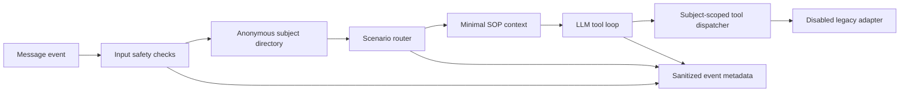

# Sport-LM

**A sanitized, non-deployable reference snapshot of a tool-using conversational agent built for a retired, project-specific workflow.**

[中文说明](README.zh-CN.md) · [Architecture](#architecture) · [Security](SECURITY.md) · [Contributing](CONTRIBUTING.md) · [License](LICENSE.md)

[](https://github.com/WandsgYu/sport-ai/actions/workflows/ci.yml)


> [!IMPORTANT]
> Sport-LM is published for learning, design review, and portfolio presentation. It is **not a reusable framework, migration package, API specification, or deployment package**. The original platform adapter, credentials, schemas, data, and operational entry point have been intentionally removed.

## At a glance

Sport-LM demonstrates how a business-process agent can combine:

- constrained tool use instead of model-generated claims of success;
- scenario routing and minimal SOP retrieval;
- subject-level authorization boundaries;
- prompt-injection checks as defense in depth;
- privacy-minimized observability;
- clean separation between agent orchestration and private platform adapters.

The public snapshot preserves those design decisions while making the original system impossible to reconstruct from this repository.

| Area | Public snapshot behavior |
| --- | --- |
| Legacy business platform | Removed; placeholder always returns `503` |
| Message-channel integration | Replaced by an abstract protocol |
| Identity data | Generic anonymous fields only |
| Logs | Event metadata, lengths, status, and process-scoped pseudonyms |
| Production startup | Intentionally disabled |
| Tests | Offline safety and privacy checks only |

## What this repository demonstrates

### 1. Tool-gated state changes

The model is never allowed to claim that a query or update succeeded on its own. The prompt, tool dispatcher, and handler all reinforce the same rule: a success message requires a successful tool result.

### 2. Scenario-first orchestration

The agent selects a small set of relevant scenarios before the main model call. Only those sanitized SOP fragments are added to context, reducing irrelevant instructions and making the decision path easier to inspect.

### 3. Subject-scoped authorization

Tool calls are bound to the subject resolved for the current channel user. Requests for another subject are rejected before any adapter is called.

### 4. Privacy-safe observability

The event pipeline avoids raw messages, names, tool arguments, tool results, credentials, IP addresses, contact details, and identity numbers. A recursive sanitizer and a logging filter provide additional protection against accidental disclosure.

## Architecture



The orchestration layer remains readable. The private integration layer does not.

## Repository map

```text
src/sport_lm/
├── api/sports.py          # disabled legacy-platform placeholder
├── llm/                   # model interface and reference adapters
├── security/              # input checks and recursive redaction
├── sop/                   # scenario parsing and routing
├── utils/                 # in-memory cache and safe event logging
├── web/                   # allowlist-only event metadata viewer
├── wecom/                 # abstract message-channel contract + handler
├── prompts.py             # sanitized behavioral constraints
├── tools.py               # authorization and tool dispatch
└── user_map.py            # generic anonymous subject directory
```

## Deliberately excluded

The repository does **not** contain:

- the original organization, people, contacts, or account mappings;
- phone numbers, identity numbers, user exports, logs, screenshots, or test records;
- internal domains, IP addresses, routes, application identifiers, secrets, or authentication flows;
- the original request and response schema;
- any executable write path to the retired platform;
- production configuration or a working production entry point;
- internal interface documentation or operational runbooks.

These omissions are part of the design of the public snapshot, not missing setup instructions.

## Safety properties

The offline test suite checks that:

1. legacy query and update operations always fail closed;
2. cross-subject access is denied;
3. common sensitive-value patterns are redacted;
4. recursive event sanitization removes private fields;
5. raw private content is never persisted by the event logger;
6. the public entry point refuses to start a production service.

## Local verification

Only offline checks are supported:

```bash
python -m compileall -q src tests
python -m unittest discover -s tests -v
```

Passing these checks does **not** make the project deployable.

## Design limitations

- This is a project-specific design snapshot, not a general agent framework.
- The public adapter cannot query or update any business system.
- The input filter is defense in depth, not a substitute for server-side authorization.
- In-memory conversation history is illustrative and not a production persistence design.
- Reference model adapters may become outdated and are not maintained as deployment integrations.
- No claim is made that this architecture is suitable for another organization or workflow.

## Responsible use

Do not use this repository to infer, probe, reconnect to, or reconstruct the retired platform. Do not submit real personal data, credentials, internal endpoints, production logs, or private documentation in issues or pull requests.

Potential security or privacy findings must be reported privately as described in [SECURITY.md](SECURITY.md).

## License

Copyright © 2026 WandsgYu.

The project is source-available under the [PolyForm Noncommercial License 1.0.0](LICENSE.md). It may be used, changed, and shared only for permitted noncommercial purposes under that license. Commercial use requires separate permission.

This license does not restore any removed integration, grant access to any external system, or imply that the snapshot is safe to deploy.

## Citation

If you reference the design in research or educational material, see [CITATION.cff](CITATION.cff).
