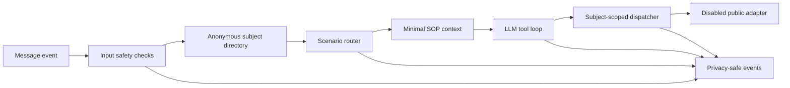

# Sport-LM

[中文说明](README.zh-CN.md) · [Security](SECURITY.md) · [Contributing](CONTRIBUTING.md)

[](https://github.com/WandsgYu/sport-ai/actions/workflows/ci.yml)


A reference implementation of a tool-using business-process agent: route each request to a small set of relevant scenarios, give the model only the context it needs, and enforce authorization again at the tool boundary.

> Sport-LM is a sanitized, non-deployable snapshot of a retired project-specific workflow. The original platform adapter, private SOPs, identities, schemas, credentials, and production entry point are not included.

## What this project demonstrates

Sport-LM focuses on the orchestration layer around an LLM rather than the model itself:

1. **Input screening** rejects obvious prompt-injection patterns as defense in depth.
2. **Subject resolution** maps the channel actor to a bounded anonymous subject.
3. **Scenario routing** selects only the relevant workflow fragments.
4. **LLM tool loop** lets the model request structured operations.
5. **Tool authorization** binds every query or update to the current subject.
6. **Safe observability** records allow-listed event metadata instead of raw conversations.

The result is an agent whose important decisions are inspectable outside the prompt.

## Architecture



## Engineering decisions

| Decision | Why it matters |
| --- | --- |
| Scenario-first context | Reduces irrelevant instructions and makes routing easier to inspect |
| Tool-gated success | The model cannot claim a query or update succeeded without a successful tool result |
| Subject-scoped calls | Cross-subject reads and writes are rejected before reaching an adapter |
| Allow-listed tool payloads | Update values are normalized to a small public vocabulary |
| Disabled legacy adapter | The portfolio snapshot cannot reconnect to or mutate the retired platform |
| Privacy-minimized events | Operators retain status and timing signals without raw messages or identifiers |

## Public snapshot behavior

| Component | Included behavior |
| --- | --- |
| Message channel | Abstract client contract and reference handler |
| Models | Interface plus reference adapters |
| SOP layer | Generic parser and scenario router |
| Business tools | Structured definitions and subject-level checks |
| Legacy integration | Refusing placeholder that returns an unavailable response |
| Web viewer | Allow-list-only event metadata views |
| Tests | Offline safety and privacy verification |

## Run the offline checks

```bash
git clone https://github.com/WandsgYu/sport-ai.git
cd sport-ai
PYTHONPATH=src python -m unittest discover -s tests -v
```

The six public tests verify that:

- cross-subject tool access is rejected;
- the legacy adapter stays disabled;
- sensitive fields are recursively removed;
- common identifier patterns are redacted;
- raw private content is not persisted in event logs;
- the public entry point refuses to start a production service.

Passing these checks does not make the repository deployable.

## Repository map

```text
src/sport_lm/
├── llm/               # model interface and reference adapters
├── sop/               # workflow parsing and scenario routing
├── security/          # input checks, redaction, pseudonymization
├── wecom/             # abstract message-channel contract and handler
├── api/sports.py      # disabled legacy-platform placeholder
├── tools.py           # tool definitions and subject authorization
├── user_map.py        # anonymous subject directory
├── utils/             # cache, logging, and safe events
└── web/               # metadata-only event viewer
tests/                 # public snapshot safety tests
```

## How this differs from Meeting AI

[Meeting AI](https://github.com/WandsgYu/meeting-AI) is a deliberately small example of confirmation-gated state changes. Sport-LM preserves a broader business-agent pipeline: channel handling, scenario retrieval, model abstraction, a tool loop, subject-level authorization, caching, and operational event views.

## Publication boundary

This repository contains the reusable ideas, not the former system:

- no organization names, people, contacts, user exports, or operational records;
- no private SOP content, production schemas, internal endpoints, or credentials;
- no working production startup or executable external write path;
- no deployment configuration, screenshots, or logs from the retired workflow.

Potential privacy or security findings should be reported through [SECURITY.md](SECURITY.md), not a public issue.

## Limitations

- This is a project-specific architecture snapshot, not a general agent framework.
- The public adapter cannot query or update a real business system.
- Input filtering is defense in depth and does not replace server-side authorization.
- In-memory history and the reference model adapters are illustrative rather than production recommendations.

## License

Copyright © 2026 WandsgYu.

Source-available under the [PolyForm Noncommercial License 1.0.0](LICENSE.md). Commercial use requires separate permission. Citation metadata is available in [CITATION.cff](CITATION.cff).
