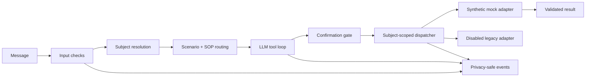

# Sport-LM

[中文说明](README.zh-CN.md) · [Case study](docs/CASE_STUDY.md)

[](https://github.com/WandsgYu/sport-lm/actions/workflows/ci.yml)


Sport-LM is an offline portfolio implementation of a tool-using business-process agent. It demonstrates both sides of a reliable workflow: a successful synthetic operation and fail-closed boundaries around the removed legacy integration.

## Run the successful path

```bash
git clone https://github.com/WandsgYu/sport-lm.git
cd sport-lm
PYTHONPATH=src python -m sport_lm.main
```

Expected flow:

```text
User: I want to enroll in synthetic item A
Agent: Parameters collected. Reply “confirm” before the state change.
User: confirm
Tool call: update_user_data(...)
Mock adapter: success, synthetic-enrollment-001
```

The demo uses no network, credentials, real identities, or production schema. Repeating the same confirmed request returns the same operation ID instead of writing twice.

## What it proves

- multi-turn parameter collection and explicit confirmation;
- structured function calls and tool-result validation;
- subject-scoped authorization at the tool boundary;
- an in-memory mock adapter with deterministic success results;
- idempotency handling for repeated confirmations;
- allow-listed event metadata without raw conversation storage;
- an LLM tool loop with swappable model adapters;
- a disabled legacy adapter that remains unable to contact a real system.

## Architecture



The scripted entry point uses a deterministic offline policy so anyone can reproduce the success path without an API key. The broader message handler retains the model abstraction, scenario selection, tool-call loop, bounded history, and structured tool dispatch used to demonstrate LLM orchestration.

## Test it

```bash
PYTHONPATH=src python -m unittest discover -s tests -v
```

The suite covers the successful tool path, confirmation gating, idempotent replay, subject isolation, redaction, privacy-safe events, the working entry point, and the disabled legacy adapter.

## Repository map

```text
src/sport_lm/
├── demo.py              # reproducible multi-turn success path
├── api/mock.py          # in-memory synthetic adapter
├── api/sports.py        # disabled legacy adapter
├── llm/                 # model interface and adapters
├── sop/                 # scenario parsing and routing
├── wecom/handler.py     # message history and LLM tool loop
├── tools.py             # schemas, authorization, dispatch
└── security/ + utils/   # redaction and safe events
docs/CASE_STUDY.md       # sanitized engineering retrospective
tests/                   # success, safety, and privacy checks
```

## Production relationship

The production project and this public repository are not the same codebase. The public version reimplements the reusable orchestration patterns with synthetic names and data. The original platform adapter, private SOPs, credentials, schemas, identities, logs, and deployment configuration are not included.

Read [docs/CASE_STUDY.md](docs/CASE_STUDY.md) for the business problem, production failure modes, metric definitions, and a precise map of what came from production experience versus what was rebuilt for this repository.

## License

Source-available under the [PolyForm Noncommercial License 1.0.0](LICENSE.md). Commercial use requires separate permission.
