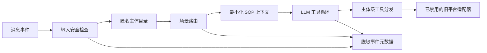

# Sport-LM

**一个经过完整脱敏、不可部署的工具型对话 Agent 设计参考快照。原项目面向已经退役的特定业务流程。**

[English](README.md) · [安全说明](SECURITY.md) · [贡献指南](CONTRIBUTING.md) · [许可](LICENSE.md)

> [!IMPORTANT]
> 本仓库仅用于学习、设计复盘和作品展示。它**不是通用框架、迁移包、接口规范或部署包**。原平台适配器、凭据、数据结构、业务数据与生产入口均已主动移除。

## 一眼看懂

Sport-LM 展示了业务办理 Agent 的几项核心设计：

- 通过工具执行查询和修改，禁止模型凭空声称成功；
- 先做场景路由，再注入最小化 SOP 上下文；
- 将工具权限限制在当前匿名主体；
- 使用提示词注入检测作为纵深防御；
- 以最少数据实现可观测性；
- 将 Agent 编排层与私有平台适配层隔离。

公开版保留设计成果，但无法据此恢复原系统。

| 模块 | 公开版本行为 |
| --- | --- |
| 旧业务平台 | 已移除；占位适配器固定返回 `503` |
| 消息通道 | 已替换为抽象协议 |
| 身份数据 | 仅保留通用匿名字段 |
| 日志 | 只记录事件元数据、长度、状态和进程内匿名引用 |
| 生产启动 | 主动禁用 |
| 测试 | 仅提供离线隐私与安全检查 |

## 核心设计

### 1. 工具约束

模型不能自行宣布查询或修改成功。Prompt、工具分发器和消息处理器共同强制要求：只有工具明确返回成功，才能向用户表达操作完成。

### 2. 场景优先

主模型调用之前，系统先选择少量相关场景，只把对应的脱敏 SOP 片段加入上下文，减少无关指令并提高流程可解释性。

### 3. 主体级权限

工具调用绑定到当前消息账号解析出的匿名主体。任何跨主体查询或修改都会在调用适配器之前被拒绝。

### 4. 隐私安全日志

事件管道不记录用户原文、姓名、工具参数、工具返回、凭据、IP、联系方式或证件信息。递归脱敏器和日志过滤器用于防止意外写入。

## 架构



Agent 编排层可供阅读，私有集成层不可恢复。

## 目录结构

```text
src/sport_lm/
├── api/sports.py          # 已禁用的旧平台占位适配器
├── llm/                   # 模型接口与参考适配器
├── security/              # 输入检查和递归脱敏
├── sop/                   # 场景解析和路由
├── utils/                 # 内存缓存和安全事件日志
├── web/                   # 仅展示白名单元数据的查看器
├── wecom/                 # 抽象消息通道与 Handler
├── prompts.py             # 脱敏后的行为约束
├── tools.py               # 权限检查和工具分发
└── user_map.py            # 通用匿名主体目录
```

## 主动移除的内容

仓库不包含：

- 原组织、人员、联系方式和账号映射；
- 手机号、证件号、用户导出、生产日志、截图或真实测试记录；
- 内部域名、IP、接口路径、应用标识、密钥和鉴权流程；
- 原平台请求与响应字段结构；
- 任何可执行的旧平台写入能力；
- 生产配置和可工作的生产启动入口；
- 内部接口文档和运维手册。

这些内容是出于安全目的主动移除，并不是缺失的安装说明。

## 离线验证

仅支持不会连接外部业务系统的检查：

```bash
python -m compileall -q src tests
python -m unittest discover -s tests -v
```

测试通过不代表本项目可以部署。

## 已知限制

- 这是特定项目的设计快照，不是通用 Agent 框架；
- 公开适配器不能查询或修改任何业务系统；
- 输入过滤不能替代后端鉴权；
- 内存会话历史仅用于展示设计，不是生产持久化方案；
- LLM 参考适配器可能随时间失效；
- 不保证该架构适合其他组织或业务流程。

## 负责任使用

请勿使用本仓库推测、探测、重连或恢复旧平台。请勿在 Issue 或 PR 中提交真实个人信息、凭据、内部地址、生产日志或私有文档。

疑似安全或隐私问题请按照 [SECURITY.md](SECURITY.md) 私下报告。

## 许可

Copyright © 2026 WandsgYu.

项目采用 [PolyForm Noncommercial License 1.0.0](LICENSE.md)，只允许该许可定义的非商业用途。商业使用需要另行取得授权。

许可不会恢复任何已移除的集成，不授予任何外部系统访问权限，也不代表本快照适合部署。
