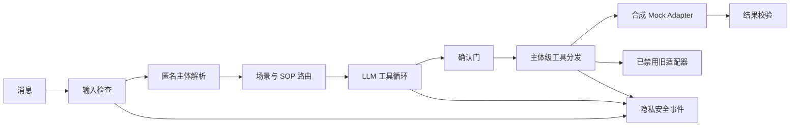

# Sport-LM

[English](README.md) · [工程案例复盘](docs/CASE_STUDY.md)

[](https://github.com/WandsgYu/sport-lm/actions/workflows/ci.yml)


Sport-LM 是一个可离线运行的业务办理 Agent 作品集项目。它同时展示两类能力：使用纯合成数据正确完成业务，以及在真实集成已移除时保持 fail-closed。

## 先跑通成功路径

```bash
git clone https://github.com/WandsgYu/sport-lm.git
cd sport-lm
PYTHONPATH=src python -m sport_lm.main
```

输出的完整闭环是：

```text
用户：我要报名示例项目A
Agent：已收集参数，这是状态变更，请确认
用户：确认提交
Function Call：update_user_data(...)
Mock Adapter：创建成功，synthetic-enrollment-001
```

整个过程不联网、不需要密钥、不使用真实身份或生产字段。相同确认重复到达时，适配器会返回同一个操作编号，不会重复写入。

## 这个项目证明什么

- 多轮参数收集和显式确认；
- 结构化 Function Calling 与工具结果校验；
- 工具边界上的主体级授权；
- 可成功读写的纯内存 Mock Adapter；
- 重复确认的幂等处理；
- 不保存用户原文的白名单事件记录；
- 可替换模型适配器的 LLM tool loop；
- 无法连接真实系统的旧适配器占位实现。

## 架构



默认演示使用确定性的离线策略，让招聘方不申请 API Key 也能复现成功路径。完整消息 Handler 仍保留模型抽象、场景选择、有限历史、LLM 工具调用循环和结构化工具分发。

## 测试

```bash
PYTHONPATH=src python -m unittest discover -s tests -v
```

测试覆盖成功执行、确认门、幂等重放、跨主体拒绝、递归脱敏、安全事件、可运行入口，以及旧适配器不可用。

## 与真实项目的关系

真实生产项目和这个公开仓库不是同一套代码。公开版只用合成数据重新实现可复用的编排思路；原平台适配器、私有 SOP、凭据、字段结构、身份数据、日志和部署配置均未公开。

更完整的业务背景、上线失败模式、指标口径，以及“生产经验”和“公开版重写”的边界见 [工程案例复盘](docs/CASE_STUDY.md)。

## 许可

项目采用 [PolyForm Noncommercial License 1.0.0](LICENSE.md)。商业使用需要另行取得授权。
